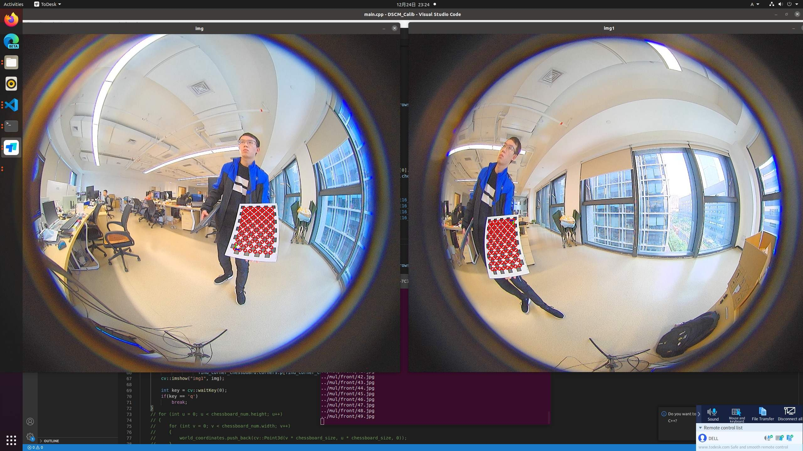

# DSCM_Calib
The calibration application with Double Sphere Camera Model

- [x] single camera calibration
- [x] multi camera calibration

> This project is developed with OpenCV 4. If you have some problem during compiling, maybe the OpenCV version is wrong. You should replace the uncompatible API manually.

> 多相机标定的时候需要手动剔除棋盘格原点对应不上的图像对，否则会标定出错，比如下图的这对图像就不能用

